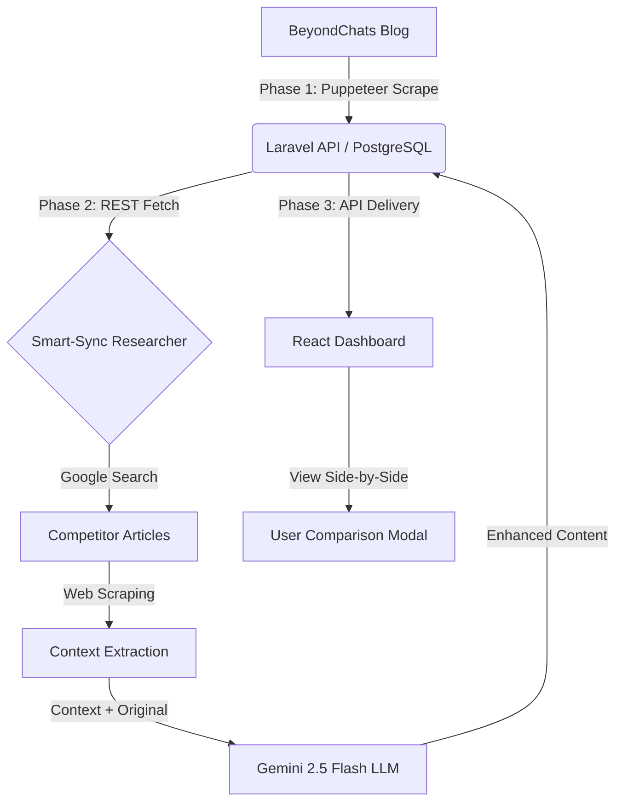

# 🚀 Article Automation System: Content Transformation Engine

Analyzing the impact of Gemini-driven research on BeyondChats blog archives.

## 📖 Project Overview

This project is an automated end-to-end pipeline designed to scrape historical articles, conduct deep competitor research via Google, and utilize LLMs to synthesize enhanced versions. The system is fully deployed with a **React** frontend on Vercel and a **Dockerized Laravel** backend on Render.

### Architecture & Data Flow Diagram

> This diagram illustrates the flow from initial scraping to AI synthesis and final UI display.



---

## 🔗 Live Links

- **Live Dashboard (Vercel):** https://article-automation-system-one.vercel.app/
- **Production API (Render):** https://article-automation-system.onrender.com/api/articles
- **GitHub Repository:** https://github.com/KailasVS666/Article_Automation_System

---

## 🛠️ Local Setup Instructions

> Follow these steps to replicate the environment locally for evaluation.

### 1. Prerequisites

- **PHP 8.2+** & **Composer** (Backend)
- **Node.js (LTS)** (Automation & Frontend)
- **PostgreSQL or MySQL** (Database)
- **Google Gemini API Key** (Phase 2 Synthesis)

### 2. Backend Setup (Laravel)

```bash
cd backend
composer install
cp .env.example .env # Configure DB_CONNECTION=pgsql or mysql
php artisan migrate
php artisan serve
```

### 3. Automation Setup (Node.js)

```bash
cd automation
npm install
# Update .env with your GEMINI_API_KEY
node scraper.js    # Phase 1: Scrapes 5 oldest articles
node researcher.js  # Phase 2: AI Research & Synthesis
```

### 4. Frontend Setup (React)

```bash
cd frontend
npm install
npm start # Launches at http://localhost:3000
```

---

## ⚡ Engineering Highlights

- **Dockerized Cloud Deployment:** Implemented a custom Dockerfile to handle PHP dependencies and PostgreSQL drivers on Render's free tier, ensuring seamless cloud migrations.
- **Idempotent Smart-Sync:** The researcher identifies original articles missing their updated pairs, preventing duplicate API costs.
- **Resilient Research Engine:** Implemented 60-second timeouts and `domcontentloaded` strategies to handle slow competitor sites.
- **Professional UI/UX:** Dark-themed dashboard with comparison modals to verify content transformation side-by-side.
- **CORS Configuration:** Securely configured Cross-Origin Resource Sharing to bridge the Vercel frontend with the Render backend.


