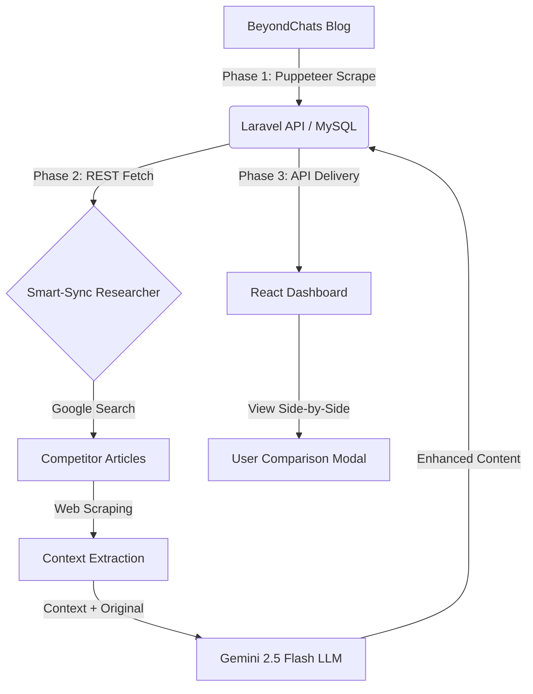

# 🚀 Article Automation System: Content Transformation Engine

Analyzing the impact of Gemini-driven research on BeyondChats blog archives.

## 📖 Project Overview

This project is an automated end-to-end pipeline designed to scrape historical articles, conduct deep competitor research via Google, and utilize LLMs to synthesize enhanced versions.

### Architecture & Data Flow Diagram

> This diagram illustrates the flow from initial scraping to AI synthesis and final UI display.



---

## 🛠️ Local Setup Instructions

> Follow these steps to replicate the environment for evaluation.

### 1. Prerequisites

- **PHP 8.2+** & **Composer** (Backend)
- **Node.js (LTS)** (Automation & Frontend)
- **MySQL** (Database)
- **Google Gemini API Key** (Phase 2 Synthesis)

### 2. Backend Setup (Laravel)

```bash
cd backend
composer install
cp .env.example .env # Ensure DB_DATABASE=beyondchats_db
php artisan migrate
php artisan serve

```

### 3. Automation Setup (Node.js)

```bash
cd automation
npm install
# Update .env with your GEMINI_API_KEY
node scraper.js    # Phase 1: Scrapes 5 oldest articles
node researcher.js  # Phase 2: AI Research & Synthesis

```

### 4. Frontend Setup (React)

```bash
cd frontend
npm install
npm start # Launches at http://localhost:3000

```

---

## ⚡ Engineering Highlights

- **Idempotent Smart-Sync:** The researcher identifies original articles missing their updated pairs, preventing duplicate API costs.
- **Persistent Browser Profiles:** Utilizes a fixed `userDataDir` to reuse browser sessions, increasing stability and preventing workspace junk.
- **Resilient Research Engine:** Implemented 60-second timeouts and `domcontentloaded` strategies to handle slow competitor sites.
- **Professional UI/UX:** Dark-themed dashboard with comparison modals to verify content transformation.

---

## 🔗 Live Links

- **GitHub Repository:** https://github.com/KailasVS666/Article_Automation_System.git
- **Live Dashboard:** Your Live Link Here

---


