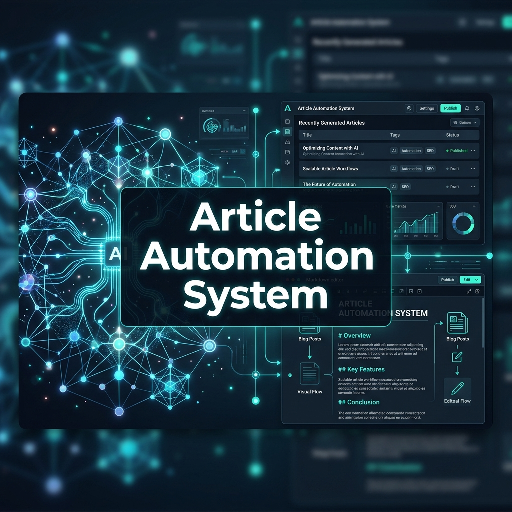
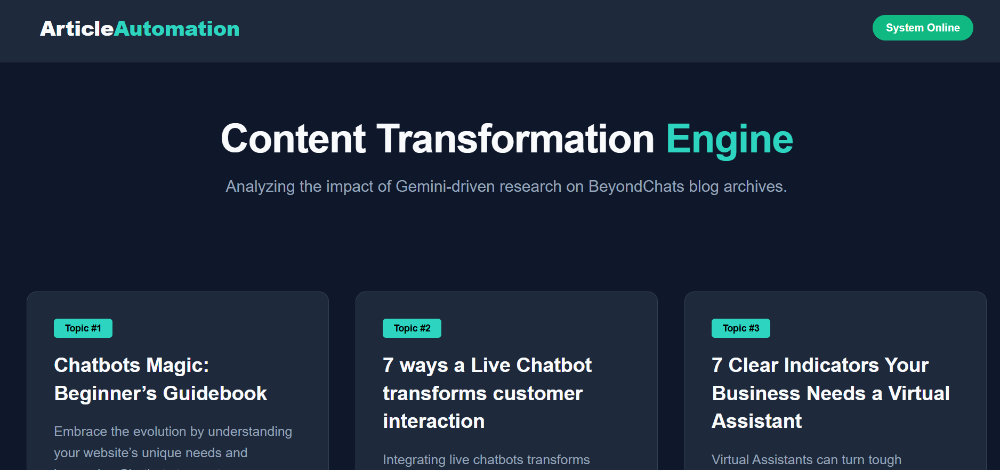
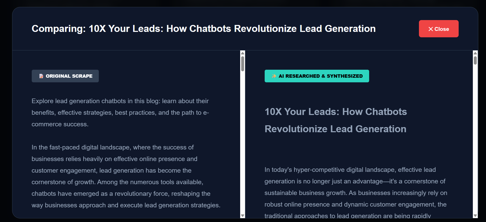
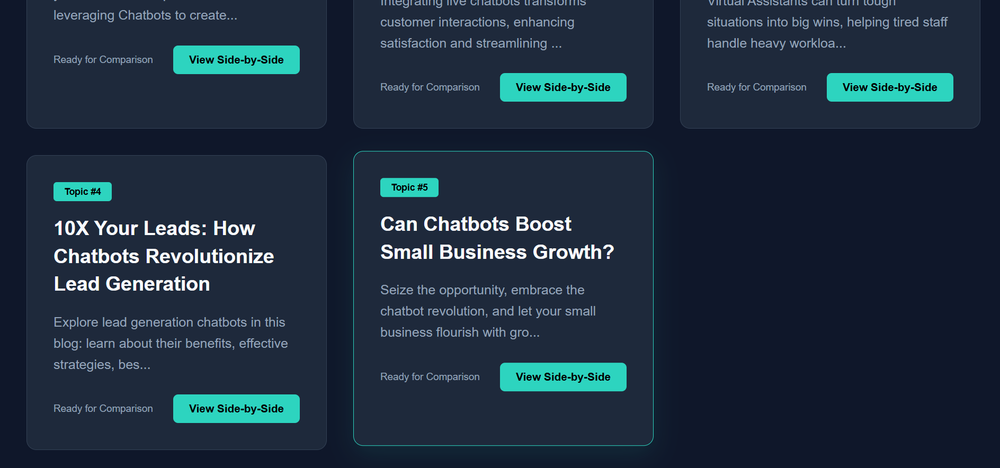
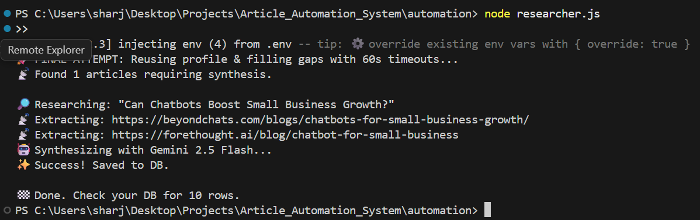
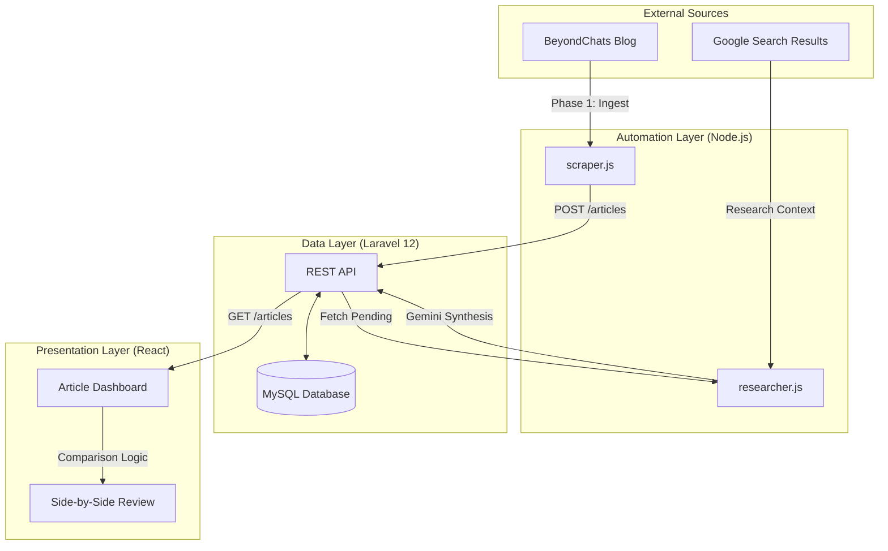

# Article Automation System



<div align="center">

[](https://opensource.org/licenses/MIT)
[](https://nodejs.org/)
[](https://laravel.com/)
[](https://reactjs.org/)
[](https://aistudio.google.com/)

**An end-to-end content engineering pipeline that modernizes legacy blog posts using web automation, semantic research, and LLM-powered synthesis.**

[Live Demo](https://article-automation-system-one.vercel.app/) • [API Endpoint](https://article-automation-system.onrender.com/api/articles) • [Report Bug](https://github.com/KailasVS666/Article_Automation_System/issues)

</div>

---

## 📖 Overview

The **Article Automation System** solves a common problem for growing companies: **Legacy Content Decay.** Many organizations have vast archives of valuable blog posts that have become outdated in structure, relevance, and SEO quality. 

This system automates the full refresh lifecycle—from deep-crawling historical archives to researching current industry context and generating professional, Markdown-formatted rewrites using Google's Gemini LLM.

### 📸 Project Sneak Peek

| **The Dashboard (End-to-End)** | **AI Transformation** |
|:---:|:---:|
|  |  |
|  |  |
| *Full-stack archival grid* | *Gemini-powered researcher in action* |

---

## 🛠️ Engineering Deep-Dive

This project goes beyond simple scripting. It demonstrates a series of high-level engineering decisions designed for reliability and scalability.

### 1. Robust Web Extraction & Research
- **Defensive Scraping**: Implemented using `Puppeteer Extra` with the `Stealth Plugin` to bypass bot detection. Controlled navigation timeouts (60s) and selective parsing ensure stability during long-running tasks.
- **Semantic Text Extraction**: Leverages `JSDOM` and `Mozilla Readability` to strip noisy UI elements (navs, footers, ads) and extract the "core" article content, ensuring the LLM receives clean, high-signal data.

### 2. Intelligent AI Synthesis Pipeline
- **Idempotency**: The `researcher.js` identifies existing records in the database and only processes pending original articles. This prevents redundant API costs and allows the pipeline to be interrupted and resumed safely.
- **Context-Aware Prompting**: Instead of simple rephrasing, the system performs a multi-stage research pass (Google SERP -> Page Extraction -> Context Injection) before prompting Gemini, resulting in articles that are factually grounded and current.

### 3. Full-Stack Data Orchestration
- **Laravel 12 Backend**: Serves as a central source of truth with a validated REST API. Eloquent ORM ensures structured storage for original vs. enhanced article pairs.
- **Dynamic React Dashboard**: A modern, glassmorphic UI that uses custom pairing logic to link articles by title similarity, enabling a seamless side-by-side comparison experience.

---

## 📐 Architecture


```mermaid
graph TD
    subgraph "External Sources"
        A[BeyondChats Blog]
        H[Google Search Results]
    end

    subgraph "Automation Layer (Node.js)"
        B[scraper.js]
        D[researcher.js]
    end

    subgraph "Data Layer (Laravel 12)"
        C[(MySQL Database)]
        E[REST API]
    end

    subgraph "Presentation Layer (React)"
        F[Article Dashboard]
        G[Side-by-Side Review]
    end

    A -->|Phase 1: Ingest| B
    B -->|POST /articles| E
    E <--> C
    E -->|Fetch Pending| D
    H -->|Research Context| D
    D -->|Gemini Synthesis| E
    E -->|GET /articles| F
    F -->|Comparison Logic| G
```

---

## 🚀 Core Competencies (Portfolio Framing)

This project demonstrates proficiency in several high-demand domains:

- **AI Engineering**: Direct integration with Google Gemini, prompt engineering, and RAG-style context injection.
- **Automation & RPA**: Advanced Puppeteer usage, stealth mechanics, and structured web data extraction.
- **Full-Stack Development**: API design (Laravel), responsive UI/UX (React), and database schema architecture (MySQL).
- **System Design**: Building an idempotent, multi-stage data pipeline with clean separation of concerns.

---

## ⚙️ Local Setup

### 1. Prerequisites
- PHP 8.2+ & Composer
- Node.js 18+
- MySQL / MariaDB

### 2. Installation
```bash
# Clone the repository
git clone https://github.com/KailasVS666/Article_Automation_System.git

# Setup Backend
cd backend
composer install
cp .env.example .env # Set your DB credentials here
php artisan key:generate
php artisan migrate

# Setup Automation
cd ../automation
npm install
# Configure .env with GEMINI_API_KEY and LOCAL_API_URL

# Setup Frontend
cd ../frontend
npm install
# Configure .env with REACT_APP_API_URL
```

### 3. Run the Pipeline
```bash
# Step 1: Ingest original content
node automation/scraper.js

# Step 2: Research & Enhance
node automation/researcher.js

# Step 3: View Results
cd frontend && npm start
```

---

## 🗺️ Roadmap & Scalability
- [ ] **Worker Queues**: Transition from scripts to Laravel Queues/Redis for concurrent processing.
- [ ] **Vector Search**: Integrate Pinecone/ChromaDB for semantic article comparisons and better research retrieval.
- [ ] **Multi-Site Support**: Parameterize selectors to support any target archive URL.
- [ ] **Export Options**: Add ability to export enhanced articles as PDF/DOCX or direct-to-WordPress.

---

<div align="center">
  Developed by <b>Kailas VS</b>
</div>
